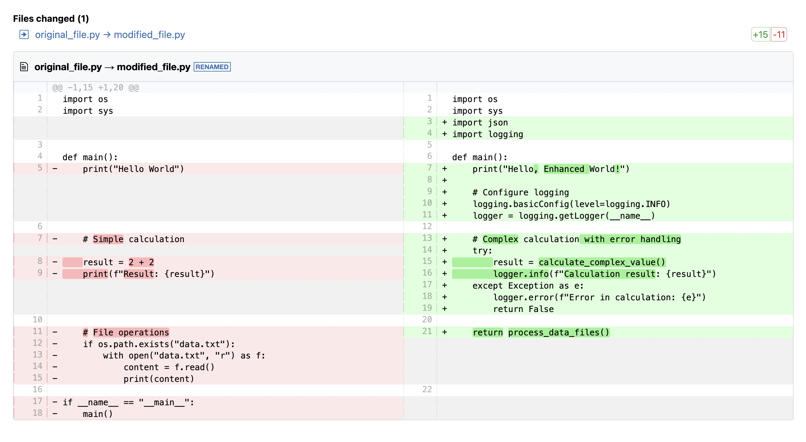

# Unified Diff MCP Server

[](https://smithery.ai/server/@gorosun/unified-diff-mcp)

Beautiful diff visualization for Claude Desktop. Transform code diffs into stunning visual comparisons with GitHub Gist integration and local file output.



## ✨ Features

- 🎨 **Beautiful HTML diff visualization** using diff2html
- 🌐 **GitHub Gist integration** for instant sharing
- 📁 **Local file output** (PNG/HTML) 
- 🔄 **Auto-delete functionality** for temporary diffs
- 🖥️ **Cross-platform support** (Windows, macOS, Linux)
- ⚡ **High-performance** with Bun runtime

## 🚀 Quick Start

### Installing via Smithery

```bash
bunx @smithery/cli install @gorosun/unified-diff-mcp --client claude
```

### Manual Installation

1. **Install [Claude Desktop](https://claude.ai/download)** and **[Bun](https://bun.sh)**
2. **Clone and build:**
   ```bash
   git clone https://github.com/gorosun/unified-diff-mcp.git
   cd unified-diff-mcp
   bun install
   ```
3. **Configure Claude Desktop** - see [Configuration](#configuration) below

## 🛠️ Tools Overview

| Tool | Purpose | Output | Best For |
|------|---------|--------|----------|
| **`visualize_diff_html_content`** | Browser display & sharing | GitHub Gist + HTML preview URL | Quick sharing, instant viewing |
| **`visualize_diff_output_file`** | Local file storage | PNG/HTML files | Local storage, presentations |

## 📖 Usage Examples

### Share diff instantly (GitHub Gist)
```
visualize_diff_html_content:
- Creates temporary GitHub Gist
- Auto-deletes after 30 minutes
- Instant browser-ready URLs
- Perfect for code reviews
```

### Save diff locally
```
visualize_diff_output_file:
- Saves PNG or HTML to local disk
- Auto-opens in browser (optional)
- Perfect for documentation
```

## 🎛️ Configuration

### Environment Variables

| Variable | Description | Default |
|----------|-------------|---------|
| `GITHUB_TOKEN` | GitHub Personal Access Token (for Gist integration) | Required for `visualize_diff_html_content` |
| `DEFAULT_AUTO_OPEN` | Auto-open generated files | `false` |
| `DEFAULT_OUTPUT_MODE` | Default output format (`html` or `image`) | `html` |

### GitHub Token Setup

1. Go to [GitHub Settings > Personal Access Tokens](https://github.com/settings/tokens)
2. Generate new token with `gist` scope
3. Add to your environment:
   ```bash
   export GITHUB_TOKEN="your_token_here"
   ```

### Claude Desktop Configuration

**macOS:**
```bash
code ~/Library/Application\ Support/Claude/claude_desktop_config.json
```

**Windows:**
```bash
code %APPDATA%\Claude\claude_desktop_config.json
```

**Configuration template:**
```json
{
  "mcpServers": {
    "unified-diff-mcp": {
      "command": "bun",
      "args": ["run", "/path/to/unified-diff-mcp/src/index.ts"],
      "env": {
        "GITHUB_TOKEN": "your_github_token_here",
        "DEFAULT_AUTO_OPEN": "true",
        "DEFAULT_OUTPUT_MODE": "html"
      }
    }
  }
}
```

## 📋 Parameters Reference

### Common Parameters

| Parameter | Type | Default | Description |
|-----------|------|---------|-------------|
| `diff` | string | *(required)* | Unified diff text |
| `format` | string | `side-by-side` | Display format (`line-by-line` or `side-by-side`) |
| `showFileList` | boolean | `true` | Show file list summary |
| `highlight` | boolean | `true` | Enable syntax highlighting |
| `oldPath` | string | `file.txt` | Original file path |
| `newPath` | string | `file.txt` | Modified file path |
| `autoOpen` | boolean | `false` | Auto-open in browser |

### GitHub Gist Specific

| Parameter | Type | Default | Description |
|-----------|------|---------|-------------|
| `expiryMinutes` | number | `30` | Auto-delete time (1-1440 minutes) |
| `public` | boolean | `false` | Public vs secret gist |

### Local File Specific

| Parameter | Type | Default | Description |
|-----------|------|---------|-------------|
| `outputType` | string | `html` | Output format (`html` or `image`) |

## 🌍 Platform Support

| Platform | Auto-Open | Commands |
|----------|-----------|----------|
| **Windows** | ✅ | `start` (primary), `explorer` (fallback) |
| **macOS** | ✅ | `open` (primary), AppleScript (fallback) |
| **Linux** | ✅ | `xdg-open` |

## 🔧 Development

**Development mode (with hot reload):**
```json
{
  "command": "bun",
  "args": ["--watch", "/path/to/unified-diff-mcp/src/index.ts"]
}
```

**Production mode:**
```json
{
  "command": "bun",
  "args": ["run", "/path/to/unified-diff-mcp/src/index.ts"]
}
```

## 📚 Advanced Usage

For detailed setup and integration guides:

- 🇺🇸 **English**: [CLAUDE_CODE_INTEGRATION.md](CLAUDE_CODE_INTEGRATION.md)
- 🇯🇵 **日本語**: [CLAUDE_CODE_INTEGRATION_JP.md](CLAUDE_CODE_INTEGRATION_JP.md)

## 🤝 Supported Clients

- **Claude Desktop** (Primary)
- **Claude Code** (CLI)
- **VS Code + MCP Extension**
- **Cline** and other MCP clients

## 📄 License

MIT License - see [LICENSE](LICENSE) file for details.

### Dependencies

| Library | License | Purpose |
|---------|---------|---------|
| **diff2html** | MIT | HTML diff generation |
| **playwright-core** | Apache 2.0 | Browser automation |
| **@modelcontextprotocol/sdk** | MIT | MCP integration |

---

**Made with ❤️ for the Claude Desktop community**
